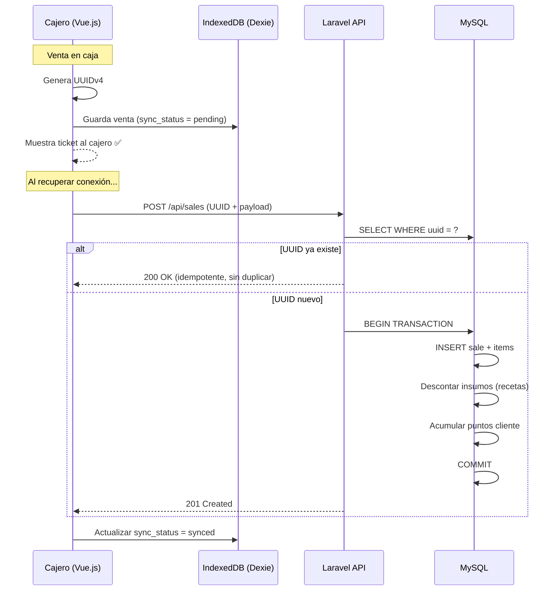

# Documento de Arquitectura — Ohana Acai V3

**Versión:** 1.1  
**Última actualización:** 2026-07-16  
**Fuente de verdad:** [PRD v3.0](file:///Users/jolopez/Downloads/Documento%20de%20Requisitos%20de%20Producto%20%28PRD%29%20-%20Ohana%20Acai%20V3.md)

---

## 1. Visión de Sistema

El sistema Ohana Acai V3 es un **POS (Punto de Venta)** y **Gestor de Inventarios** diseñado para operar bajo una modalidad **Offline-First**. Su propósito central es:

- Agilizar las ventas en caja (bowls personalizables, venta por peso, cafetería).
- Automatizar arqueos de caja rápidos al cierre de turno.
- Imprimir comandas inteligentes dirigidas al área de preparación correspondiente.
- Controlar inventarios mediante recetas con Costo Promedio Ponderado (CPP).
- Integrar pedidos de delivery de terceros (PedidosYa) de forma directa.

**Roles del sistema:** Administrador y Cajero.

---

## 2. Stack Tecnológico

| Capa | Tecnología | Justificación |
| :--- | :--- | :--- |
| **Frontend** | Vue.js (SPA / PWA) | Interfaz táctil ultrarrápida sin recargas de página. |
| **Local DB** | IndexedDB (Dexie.js) | Almacenamiento offline para ventas sin internet. |
| **Backend API** | PHP (Laravel RESTful) | Reglas de negocio, colas, seguridad con Sanctum. |
| **Server DB** | MySQL / MariaDB (utf8mb4) | Fuente de verdad relacional con integridad ACID. |

---

## 3. Estructura del Monorepo

```
/Sistema de Ventas
├── backend/                    # Proyecto Laravel
│   ├── app/
│   │   ├── Http/
│   │   │   ├── Controllers/    # Controladores limpios (solo Request → Response)
│   │   │   ├── Requests/       # FormRequests de validación
│   │   │   └── Resources/      # API Resources (transformadores JSON)
│   │   ├── Models/             # Eloquent con SoftDeletes obligatorio
│   │   ├── Services/           # Lógica de negocio (CPP, fidelización, sync)
│   │   ├── Repositories/       # Consultas complejas aisladas
│   │   ├── Jobs/               # Procesamiento asíncrono (colas)
│   │   ├── Events/             # Eventos de dominio
│   │   └── Observers/          # Auditoría automática de modelos
│   ├── database/
│   │   └── migrations/         # Migraciones versionadas
│   ├── routes/
│   │   └── api.php             # Rutas RESTful protegidas con Sanctum
│   └── tests/
│       ├── Unit/
│       └── Feature/
│
├── frontend/                   # Proyecto Vue.js
│   ├── src/
│   │   ├── components/         # Componentes reutilizables
│   │   ├── views/              # Vistas/páginas (POS, Dashboard, Config)
│   │   ├── stores/             # Pinia stores (carrito, sesión, red)
│   │   ├── composables/        # Lógica reutilizable (useSync, useNetwork)
│   │   ├── services/           # Clientes HTTP y lógica de sync
│   │   ├── db/                 # Configuración de Dexie.js (esquema local)
│   │   └── assets/
│   └── tests/
│
├── docs/                       # Documentación técnica
│   └── architecture.md         # ← Este archivo
└── .cursorrules                # Estándares para agentes de IA
```

---

## 4. Modelo de Datos Relacional (MySQL)

### 4.1. Diagrama Entidad-Relación

```mermaid
erDiagram
    USERS {
        int id PK
        string name
        string email
        string password
        string role "admin | cashier"
        string pin "PIN para anulaciones"
        timestamp deleted_at "Soft Delete"
    }

    CUSTOMERS {
        int id PK
        string ci_or_phone UK "CI o Celular — Identificador único"
        string name
        decimal loyalty_points "Puntos acumulados de cashback"
        string segment "vip | at_risk | new | interest"
        boolean is_vip_pricing "Acceso a precios preferenciales"
        timestamp deleted_at "Soft Delete"
    }

    CATEGORIES {
        int id PK
        string name "Helados, Cafetería, Paninis..."
        int parent_id FK "Nullable — Para subcategorías"
        int sort_order "Orden visual en POS"
        timestamp deleted_at "Soft Delete"
    }

    PRODUCTS {
        int id PK
        string name
        string image_url "Foto/icono para cuadrícula POS"
        decimal price
        decimal vip_price "Nullable — Precio preferencial"
        boolean is_weight_based "true = venta por peso (gramos)"
        decimal price_per_gram "Nullable — Solo si is_weight_based"
        int category_id FK
        string printer_target "kitchen | bar | none"
        boolean is_active
        timestamp deleted_at "Soft Delete"
    }

    INGREDIENTS {
        int id PK
        string name
        string unit "kg | litros | unidades | sacos"
        decimal current_stock
        decimal minimum_stock "Umbral para alertas"
        decimal unit_cost "Último costo unitario conocido"
        decimal weighted_avg_cost "CPP calculado"
        date expiration_date "Nullable — Caducidad rígida"
        date min_shelf_date "Nullable — Caducidad mínima"
        timestamp deleted_at "Soft Delete"
    }

    RECIPES {
        int id PK
        int product_id FK
        int ingredient_id FK
        decimal quantity_required "Cantidad por unidad de producto"
    }

    SALES {
        uuid id PK "UUIDv4 generado en frontend"
        int cashier_id FK
        int customer_id FK "Nullable"
        decimal subtotal
        decimal discount_amount "Puntos redimidos, descuento VIP"
        decimal total_amount
        string status "completed | voided"
        string void_reason "Nullable — Motivo de anulación"
        int voided_by FK "Nullable — Admin que autorizó"
        string source "pos | pedidosya"
        string sync_status "pending | synced | failed"
        timestamp created_at
        timestamp deleted_at "Soft Delete"
    }

    SALE_PAYMENTS {
        int id PK
        uuid sale_id FK
        string method "cash | card | qr | delivery_platform | mixed"
        decimal amount
    }

    SALE_ITEMS {
        int id PK
        uuid sale_id FK
        int product_id FK
        decimal quantity "Unidades o gramos"
        decimal unit_price
        decimal subtotal
        json topping_modifications "Toppings base removidos y extras añadidos"
    }

    INVENTORY_MOVEMENTS {
        int id PK
        int ingredient_id FK
        decimal quantity_changed "Positivo = entrada, Negativo = salida"
        string type "sale | waste | restock | adjustment"
        string waste_category "Nullable — expired | damaged | spillage"
        string notes
        int performed_by FK
        timestamp created_at
    }

    LOYALTY_CONFIG {
        int id PK
        decimal accumulation_rate "Ej: 10 Bs = 1 punto"
        decimal redemption_value "Valor en Bs de cada punto"
        int points_expiration_days "Días hasta vencimiento"
        json excluded_categories "IDs de categorías excluidas"
    }

    CASH_REGISTER_SESSIONS {
        int id PK
        int cashier_id FK
        decimal opening_amount "Fondo de caja inicial"
        decimal expected_closing "Calculado por sistema"
        decimal actual_closing "Declarado por cajero"
        decimal difference "Sobrante o faltante"
        string status "open | closed"
        timestamp opened_at
        timestamp closed_at
    }

    DELIVERY_ORDERS {
        int id PK
        string platform "pedidosya"
        string external_id "ID de la plataforma"
        json order_payload "Datos crudos del webhook"
        string status "received | preparing | ready | picked_up"
        uuid sale_id FK "Nullable — Venta vinculada"
        timestamp created_at
    }

    CATEGORIES ||--o{ CATEGORIES : "subcategoría de"
    CATEGORIES ||--o{ PRODUCTS : "clasifica"
    PRODUCTS ||--o{ RECIPES : "se compone de"
    INGREDIENTS ||--o{ RECIPES : "es insumo de"
    CUSTOMERS ||--o{ SALES : "realiza"
    USERS ||--o{ SALES : "atiende"
    SALES ||--|{ SALE_ITEMS : "contiene"
    SALES ||--|{ SALE_PAYMENTS : "se paga con"
    PRODUCTS ||--o{ SALE_ITEMS : "vendido en"
    INGREDIENTS ||--o{ INVENTORY_MOVEMENTS : "registra"
    USERS ||--o{ INVENTORY_MOVEMENTS : "ejecuta"
    USERS ||--o{ CASH_REGISTER_SESSIONS : "opera"
    DELIVERY_ORDERS ||--o| SALES : "genera"
```



### 4.2. Decisiones de Diseño de la BD

| Decisión | Justificación |
| :--- | :--- |
| UUID en `SALES` | Generado offline en frontend. Garantiza idempotencia sin autoincrement. |
| `sync_status` en `SALES` | Bandera para el flujo offline → online. |
| `SALE_PAYMENTS` separado | Soporta pagos mixtos (parte efectivo, parte QR). |
| `topping_modifications` como JSON | Flexibilidad para bowls personalizables sin explotar en tablas. |
| `printer_target` en `PRODUCTS` | Dirige la comanda a la cocina, barra de café, o ninguna. |
| `CASH_REGISTER_SESSIONS` | Requerido por PRD para arqueos de caja rápidos. |
| `DELIVERY_ORDERS` | Almacena el payload crudo de PedidosYa antes de convertirlo en venta interna. |
| `weighted_avg_cost` en `INGREDIENTS` | Campo precalculado del CPP, actualizado en cada restock dentro de `DB::transaction()`. |

---

## 5. Patrones Críticos de Diseño

### 5.1. Modelo Offline-First y Sincronización



**Reglas clave del flujo:**
1. El frontend descarga y cachea el catálogo activo (categorías, productos, precios, clientes frecuentes) al arrancar.
2. Las ventas offline se graban localmente con `sync_status: pending`.
3. El sync manager del frontend envía lotes de tickets pendientes cuando detecta conexión.
4. El backend verifica el UUID antes de procesar — **nunca duplica cobros**.
5. Tickets sincronizados (`synced`) se purgan del navegador tras **7 días** (pruning automático).

### 5.2. Inventario basado en Recetas (CPP)

- Los **productos finales** ("Bowl Grande", "Panini Clásico") no tienen stock propio.
- Se componen de **insumos** ("Acai pulpa", "Granola", "Queso mozzarella") mediante la tabla `RECIPES`.
- Al registrar una venta, el backend recorre las recetas del producto y descuenta cada insumo proporcionalmente.
- El **Costo Promedio Ponderado** se recalcula en cada ingreso de mercadería (`restock`) dentro de un `DB::transaction()`:

```
CPP_nuevo = (stock_actual × CPP_actual + cantidad_nueva × costo_nuevo)
             ÷ (stock_actual + cantidad_nueva)
```

### 5.3. CRM y Fidelización (Cashback)

- Un cliente acumula puntos según la `accumulation_rate` configurada (ej: 10 Bs = 1 punto).
- Los puntos tienen fecha de vencimiento configurable (`points_expiration_days`).
- Se pueden excluir categorías completas de la acumulación de puntos.
- **Clientes VIP** tienen acceso a `vip_price` en productos donde esté definido.
- La **segmentación dinámica** (VIP, En Riesgo de Fuga, Nuevo) se calcula periódicamente mediante un Job de Laravel basado en frecuencia y recencia de compras.
- **Offline:** Los puntos se calculan provisionalmente en el frontend y se consolidan como reales al sincronizar con el backend.

### 5.4. Arqueo de Caja

- Cada turno de cajero abre una sesión (`CASH_REGISTER_SESSIONS`) declarando el fondo de caja inicial.
- Al cerrar turno, el sistema calcula automáticamente el monto esperado (ventas en efectivo del turno).
- El cajero declara el monto real contado y el sistema calcula la diferencia (sobrante/faltante).

### 5.5. Impresión Inteligente de Comandas

- Cada producto tiene un campo `printer_target` que indica a qué área se dirige su comanda:
  - `kitchen` → Cocina (bowls, paninis).
  - `bar` → Barra de café.
  - `none` → Sin comanda (ej: bebidas embotelladas).
- Al confirmar una venta, el POS genera automáticamente las comandas agrupadas por área de preparación.

### 5.6. Integración PedidosYa

- Los webhooks entrantes de PedidosYa se reciben en un endpoint dedicado.
- El payload se almacena crudo en `DELIVERY_ORDERS` y se procesa de forma asíncrona mediante **Jobs y Queues** de Laravel para no bloquear el hilo HTTP.
- Una vez procesado, se genera una `SALE` vinculada con `source: pedidosya`.
- El POS recibe notificación del nuevo pedido vía **WebSockets** o long-polling.
- Botones en POS permiten cambiar estado: `preparing → ready → picked_up`, sincronizando con la plataforma.

---

## 6. Seguridad

| Aspecto | Implementación |
| :--- | :--- |
| Autenticación SPA-API | Laravel Sanctum (tokens sin estado) |
| Validación de requests | FormRequests estrictos en cada endpoint |
| Anulación de ventas | PIN de Administrador verificado en backend |
| Protección de rutas | Middleware `auth:sanctum` en todas las rutas API |
| Roles y permisos | `admin` puede todo. `cashier` limitado a POS y consultas. |
| Errores seguros | Nunca exponer trazas de stack al frontend (JSON estandarizado). |

---

## 7. Indicadores Visuales de Estado de Red

El frontend DEBE mantener un indicador visual persistente:

| Estado | Indicador | Comportamiento |
| :--- | :--- | :--- |
| Conectado | 🟢 Verde | Operación normal, sync en tiempo real. |
| Offline | 🔴 Rojo | Vendiendo con datos locales, ventas en cola. |
| Sincronizando | 🔄 Azul animado | Enviando tickets pendientes al servidor. |

---

_Las directivas completas de escritura de código por IA se encuentran en el archivo [.cursorrules](file:///Users/jolopez/Sistema%20de%20Ventas/.cursorrules) de este repositorio._
