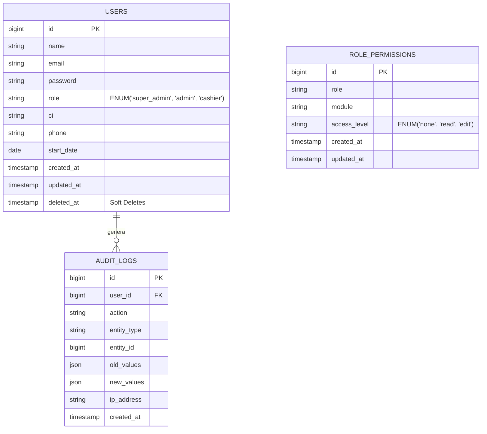
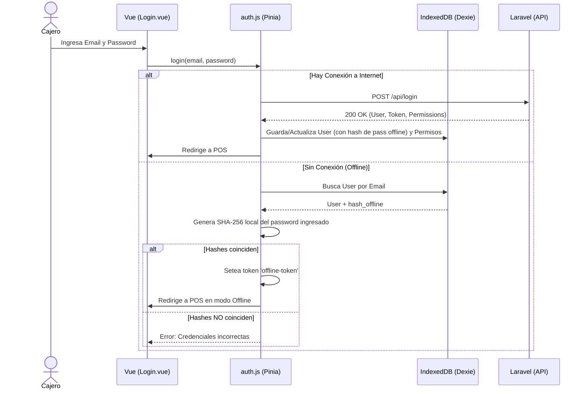
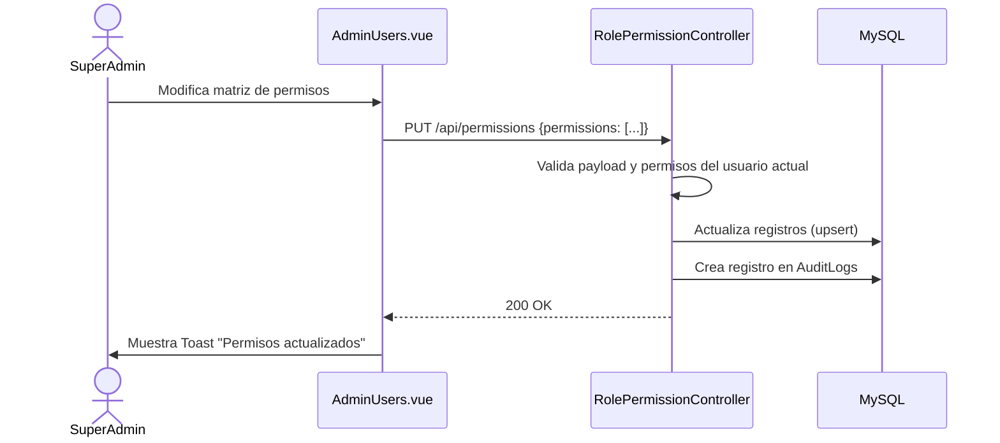

# Diseño de Fase 1: Cimientos y Seguridad

Este documento describe la arquitectura, flujos y diseño de interfaz para el módulo de Autenticación, Gestión de Usuarios, Roles/Permisos y Auditoría. Se basa en el código ya definido en Laravel 13 y Vue.js.

## 🗄️ Esquema de Base de Datos (ERD)

## 🔄 Flujos de Sistema (Sequence Diagrams)

### 1. Flujo de Login (Híbrido: Online / Offline)

El sistema de caja está diseñado para funcionar aunque no haya internet, almacenando un hash de la contraseña en IndexedDB.

### 2. Flujo de Matriz de Permisos (RBAC)

Los permisos se asignan a roles completos, no a usuarios individuales, para facilitar la administración.

## 🎨 Interfaz de Usuario (UI)

Las interfaces ya desarrolladas en el frontend siguen un sistema de diseño premium con:
- **Colores principales:** Açaí (Morado `#4B2E52`), Leaf (Verde `#5C7A3F`), Coffee (`#8B5E3C`).
- **Tipografía:** Fraunces para títulos, Manrope para interfaces, JetBrains Mono para datos precisos (CI, IDs).
- **Componentes Modales y Toasts** para feedback inmediato.

### `Login.vue`
- Layout centrado.
- Advertencia visual si el sistema detecta que está en modo Offline (banner rojo/naranja).
- Inputs de email y contraseña (o PIN).

### `AdminUsers.vue`
- **Tabs:** Dos pestañas principales (Usuarios, Roles y Permisos).
- **Tab Usuarios:** Tabla con lista de usuarios (Avatar, Nombre, CI, Rol con color de badge). Botones de acción: Editar, Resetear Password, Eliminar.
- **Tab Permisos:** Una matriz interactiva. Filas = Módulos, Columnas = Roles (Cajero, Admin). Botones segmentados interactivos para seleccionar `Ninguno`, `Lectura`, `Edición`.
- **Modales:** Modal estilizado para la creación/edición de usuarios.

---

> [!NOTE]
> Revisa la lista de tareas de implementación en el archivo `task.md` y confirma si apruebas este diseño para empezar a ejecutar el código (backend y frontend) faltante.
